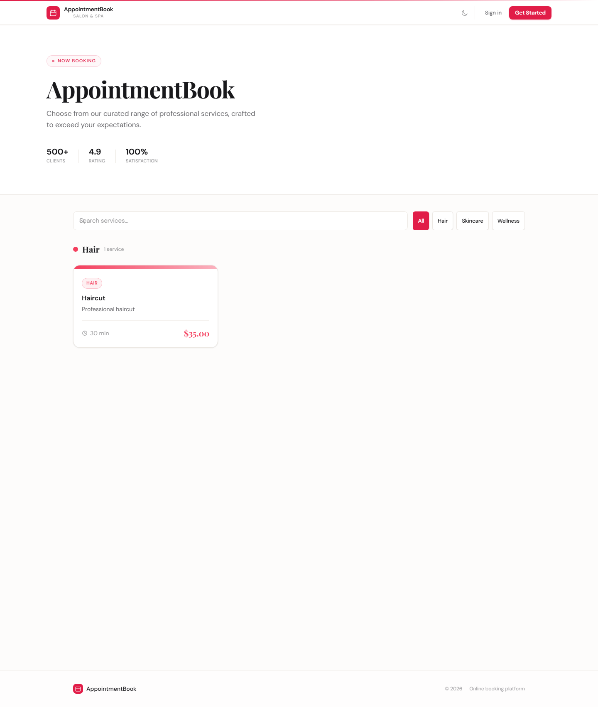
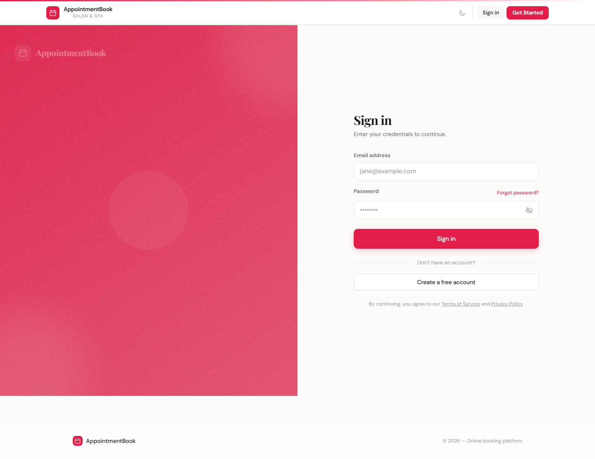
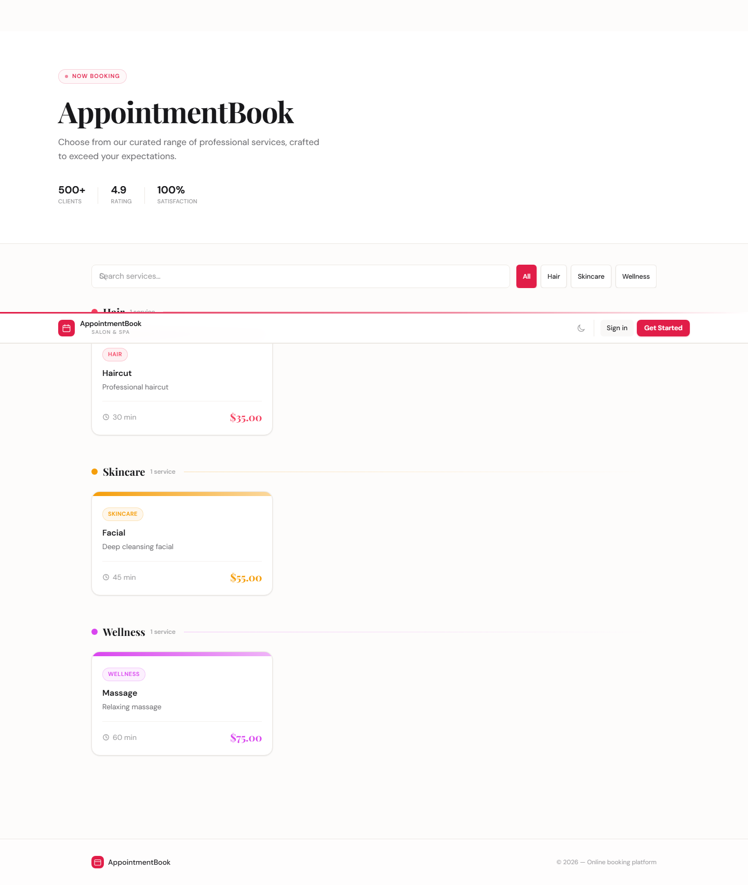

# AppointmentBook — Premium Booking System

<p align="center">
  <strong>Full-stack appointment scheduling platform.</strong><br />
  Customers browse services, book appointments, and manage bookings.<br />
  Admins manage services, staff, payments, analytics, and more.
</p>

<p align="center">
  <a href="#features">Features</a> ·
  <a href="#demo-credentials">Demo</a> ·
  <a href="#quick-start">Quick Start</a> ·
  <a href="#deployment">Deploy</a> ·
  <a href="#tech-stack">Tech Stack</a>
</p>

---

## 📸 Screenshots

<p align="center">
  
  
</p>
<p align="center">
  
  
</p>

---

## ✨ Features

### 📅 Core Booking Engine
| | Feature |
|---|---|
| ✅ | **3-step booking flow** — Service → Date/Time → Notes with live summary |
| ✅ | **Visual availability calendar** — Color-coded days (green=available, amber=limited, red=full) |
| ✅ | **Time slot selection** — 30-min intervals from 08:00–17:30 with conflict detection |
| ✅ | **Service catalog** — Grouped by category with search, filter, and image support |
| ✅ | **Appointment management** — View, filter (All/Upcoming/Past), paginate, cancel, reschedule |

### 👑 Admin Dashboard
| | Feature |
|---|---|
| ✅ | **Business settings** — Name, type (35+), description, primary color, category colors |
| ✅ | **Service management** — Create, edit, soft-delete, restore with image upload |
| ✅ | **Appointment overview** — All bookings with status management (confirm/complete/cancel) |
| ✅ | **User management** — List users, promote/demote roles, delete with cascading cleanup |
| ✅ | **Staff management** — Profiles, schedules, availability, leave tracking, clock in/out |
| ✅ | **Coupons & discounts** — Create and manage discount codes |
| ✅ | **Analytics dashboard** — Revenue, bookings, customer metrics |
| ✅ | **Finance tab** — Tax configuration, dynamic pricing, tips, credits |
| ✅ | **CSV import/export** — Bulk import services & appointments |
| ✅ | **Calendar management** — iCal feed URLs for Google/Apple/Outlook |
| ✅ | **Public booking page** — White-label embeddable booking flow |
| ✅ | **Embeddable widget** — Iframe widget for any website |
| ✅ | **Developer tools** — API key management & webhooks |

### 💳 Payments
| | Feature |
|---|---|
| ✅ | **Stripe integration** — Credit/debit card payments |
| ✅ | **PayPal integration** — PayPal checkout button |
| ✅ | **Deposits** — Collect partial payment upfront |
| ✅ | **Refunds** — Full refund processing |
| ✅ | **Coupons** — Discount code application at checkout |
| ✅ | **Invoice generation** — Payment history & receipts |

### 📧 Notifications
| | Feature |
|---|---|
| ✅ | **Booking confirmation** — HTML email with appointment details + CTA |
| ✅ | **Cancellation notice** — Confirmation with rebook link |
| ✅ | **Reschedule confirmation** — Old → new time comparison |
| ✅ | **Status change** — Notify on complete/reopen |
| ✅ | **Auto reminders** — Background scheduler (~24h before) |
| ✅ | **Admin alerts** — Notifications for bookings, cancellations, reschedules |
| ✅ | **Per-user opt-in/out** — Preference-aware sending |
| ✅ | **SMS notifications** — Twilio integration |
| ✅ | **Dev fallback** — Logs to console when no API key |

### 👤 Customer Features
| | Feature |
|---|---|
| ✅ | **Profile page** — Booking history & account details |
| ✅ | **Notification preferences** — Email/SMS opt-in toggles |
| ✅ | **Waiting list** — Join waitlist for fully booked slots |
| ✅ | **iCal subscription** — Sync appointments to any calendar app |
| ✅ | **CSV export** — Download appointments as CSV |
| ✅ | **Loyalty points** — Points & rewards system |
| ✅ | **Gift cards** — Purchase & redeem gift cards |
| ✅ | **Referral system** — Refer friends for rewards |
| ✅ | **Packages** — Bundle deals & multi-session packages |

### 🛠️ Technical
| | Feature |
|---|---|
| ✅ | **PostgreSQL** — ACID-compliant with connection pooling |
| ✅ | **JWT auth** — Secure token-based authentication |
| ✅ | **Zod validation** — Input validation on all endpoints |
| ✅ | **Rate limiting** — Per-route configurable limits |
| ✅ | **Structured logging** — Pino (pretty dev / JSON prod) |
| ✅ | **Error handling** — Standardized ApiError format |
| ✅ | **CORS** — Configurable origin whitelist |
| ✅ | **Google Calendar sync** — OAuth-based two-way sync |
| ✅ | **Zoom/Google Meet** — Video conferencing link generation |
| ✅ | **Multi-tenancy** — SaaS mode with isolated tenants |
| ✅ | **Outgoing webhooks** — Integration with external services |
| ✅ | **26 DB migrations** — Versioned with checksum verification |

### 🎨 UI/UX
| | Feature |
|---|---|
| ✅ | **Custom warm theme** — Indigo primary, Playfair Display + DM Sans |
| ✅ | **Full dark mode** — Persisted preference, all colors inverted |
| ✅ | **Responsive** — Mobile-first with bottom drawer nav |
| ✅ | **PWA** — Service worker + install prompt |
| ✅ | **Animations** — Fade, slide, scale, staggered card entries |
| ✅ | **Loading skeletons** — Animated placeholders for async content |
| ✅ | **Toast notifications** — Success/error feedback |
| ✅ | **Confirm dialogs** — Reusable with danger/warning/primary variants |

---

## 🚀 Demo Credentials

Once the application is running, use these credentials to explore:

| Role | Email | Password |
|------|-------|----------|
| **Admin** | `admin@demo.com` | `admin123` |
| **Customer** | `customer@demo.com` | `customer123` |

> **Note:** These accounts are auto-seeded on first run. Change the password immediately in production.

---

## 🔧 Quick Start

### Prerequisites
- [Docker Desktop](https://docs.docker.com/get-docker/) (for local PostgreSQL)
- Node.js 18+ (20 or 22 recommended)

### One-command setup

```bash
cd "Appointment-booking app"
chmod +x start-dev.sh
./start-dev.sh
```

This single command:
1. Starts PostgreSQL via Docker Compose
2. Installs server & client dependencies
3. Runs database migrations & seeds sample data
4. Starts the API server (port 3001)
5. Starts the Vite dev server (port 5173)
6. Shows a status dashboard with all URLs

### Manual setup

```bash
# 1. Start PostgreSQL
docker compose up -d

# 2. Configure & start the server
cd server
cp .env.example .env              # Edit JWT_SECRET
npm install
npm run dev                       # → http://localhost:3001

# 3. Start the client (new terminal)
cd client
cp .env.example .env              # Optional: VITE_PAYPAL_CLIENT_ID
npm install
npm run dev                       # → http://localhost:5173
```

The server auto-runs migrations and seeds 8 default services + demo users on first start. The Vite dev server proxies `/api` requests to `http://localhost:3001`.

---

## 📦 Deployment

### Railway (recommended — one click)

```bash
# 1. Push to GitHub
# 2. Go to railway.app → New Project → Deploy from GitHub repo
# 3. Add PostgreSQL database (+ New → Database → PostgreSQL)
# 4. Add environment variables (see below)
# 5. Done — Railway auto-injects DATABASE_URL
```

The included `nixpacks.toml` configures Railway's build system automatically.

### Render.com

```bash
# 1. Push to GitHub
# 2. Go to render.com → New Web Service → Connect your repo
# 3. Root Directory: Appointment-booking app/server
# 4. Build Command: npm install
# 5. Start Command: node index.js
# 6. Add PostgreSQL (+ New PostgreSQL database)
# 7. Set environment variables
```

### Required Environment Variables

| Variable | Description |
|----------|-------------|
| `DATABASE_URL` | PostgreSQL connection string (auto-provided by Railway) |
| `JWT_SECRET` | Random 64+ character string (`node -e "console.log(require('crypto').randomBytes(48).toString('hex'))"`) |
| `APP_URL` | Public URL of your app (e.g., `https://myapp.com`) |

### Optional Environment Variables

| Variable | Description |
|----------|-------------|
| `RESEND_API_KEY` | Transactional email via Resend (dev: console fallback) |
| `FROM_EMAIL` | Sender email address |
| `STRIPE_SECRET_KEY` | Stripe payment processing |
| `VITE_PAYPAL_CLIENT_ID` | PayPal payment button (client env) |
| `TWILIO_ACCOUNT_SID` | SMS notifications via Twilio |
| `TWILIO_AUTH_TOKEN` | Twilio authentication |
| `TWILIO_PHONE_NUMBER` | Twilio sending number |
| `GOOGLE_CLIENT_ID` | Google Calendar sync OAuth |
| `GOOGLE_CLIENT_SECRET` | Google Calendar sync OAuth |
| `ZOOM_CLIENT_ID` | Zoom video conferencing |
| `ZOOM_CLIENT_SECRET` | Zoom video conferencing |
| `PORT` | Server port (default: 3001) |
| `CORS_ORIGINS` | Comma-separated allowed origins |
| `DISABLE_SCHEDULER` | Set `true` to disable reminder scheduler |

### VPS / Manual Deployment

```bash
# Build the client
cd client
npm run build    # outputs to dist/

# On your server:
git clone https://github.com/GMSnowFlakes/appointment-booking-app.git
cd Appointment-booking app/server
npm install --production
cp .env.example .env && nano .env    # Configure everything
node index.js                        # Or use PM2: pm2 start index.js

# Serve the client build via Nginx or your API
```

---

## 🧪 Running Tests

```bash
# From the project root (176+ tests)
npm test                    # Server → Client (sequential, ~9s)
npm run test:parallel       # Both concurrently (~5s)
npm run test:server         # Server only (113 tests)
npm run test:client         # Client only (63 tests)
./start-test.sh             # One-command runner

# Single file
./start-test.sh --file auth.test.js
npx vitest run __tests__/auth.test.js --prefix server
```

Test coverage:
| Suite | Tests | Type |
|-------|-------|------|
| Server unit | 113+ | Vitest + supertest (in-memory SQL mock) |
| Client unit | 63+ | Vitest + @testing-library/react |
| E2E | 3 specs | Playwright (isolated Postgres schema per run) |

---

## 🏗️ Project Structure

```
Appointment-booking app/
├── client/                  # React 19 + Vite 8 + Tailwind CSS 4
│   ├── src/                 # Components, contexts, hooks
│   ├── e2e/                 # Playwright E2E tests
│   └── package.json
├── server/                  # Node.js + Express + PostgreSQL
│   ├── routes/              # 25+ route handlers
│   ├── migrations/          # 26 versioned DB migrations
│   ├── __tests__/           # Vitest unit tests
│   └── package.json
├── .github/workflows/       # GitHub Actions CI
├── docker-compose.yml       # Local PostgreSQL
├── PROJECT_STATE.md         # Full feature list & known limitations
├── CHANGELOG.md             # Release history (Keep a Changelog format)
├── PLAN.md                  # Implementation plan
├── LICENSE                  # MIT license
├── start-dev.sh             # One-command dev startup
└── start-test.sh            # One-command test runner
```

---

## 📖 Documentation

| Document | Contents |
|----------|----------|
| [`PROJECT_STATE.md`](./PROJECT_STATE.md) | Complete feature list, API endpoints, DB schema, test infra, mock limitations, deployment guide |
| [`client/README.md`](./client/README.md) | Client setup, component test coverage, E2E patterns, env vars |
| [`server/README.md`](./server/README.md) | Server setup, API reference, test patterns, mock limitations table |
| [`CHANGELOG.md`](./CHANGELOG.md) | Version history and release notes |

## CI Status

| Job | Status |
|-----|--------|
| **Lint** | [](https://github.com/GMSnowFlakes/appointment-booking-app/actions/workflows/ci.yml) |
| **Server Unit Tests** | [](https://github.com/GMSnowFlakes/appointment-booking-app/actions/workflows/ci.yml) |
| **Client Unit Tests** | [](https://github.com/GMSnowFlakes/appointment-booking-app/actions/workflows/ci.yml) |
| **E2E Tests** | [](https://github.com/GMSnowFlakes/appointment-booking-app/actions/workflows/ci.yml) |
| **Overall** | [](https://github.com/GMSnowFlakes/appointment-booking-app/actions/workflows/ci.yml) |
| **Node.js Versions** | [](https://nodejs.org) |

> **First-time setup:** Replace `YOUR-USERNAME` and `YOUR-REPO` in the badge URLs with your actual GitHub repository details.

## Tech Stack

| Layer | Technology |
|-------|-----------|
| **Frontend** | React 19, Vite 8, Tailwind CSS 4, Vitest |
| **Backend** | Node.js, Express, Zod, JWT |
| **Database** | PostgreSQL 16 (pg, connection pooling) |
| **Tests** | Vitest, supertest, @testing-library/react, Playwright |
| **CI/CD** | GitHub Actions (3 Node versions × 3 job types + lint) |
| **Email** | Resend (with dev console fallback) |
| **Payments** | Stripe + PayPal |
| **SMS** | Twilio |
| **Infrastructure** | Docker Compose, Railway-ready, nixpacks.toml |
| **License** | MIT |

---

## 📄 License

This project is licensed under the [MIT License](./LICENSE). You are free to use, modify, and distribute this software for commercial and personal projects.

---

## 🤝 Support

- **Issues & Feature Requests** — Open a GitHub issue
- **Documentation** — See [`PROJECT_STATE.md`](./PROJECT_STATE.md) for full details
- **Deployment Help** — Check the [Deployment](#-deployment) section above
